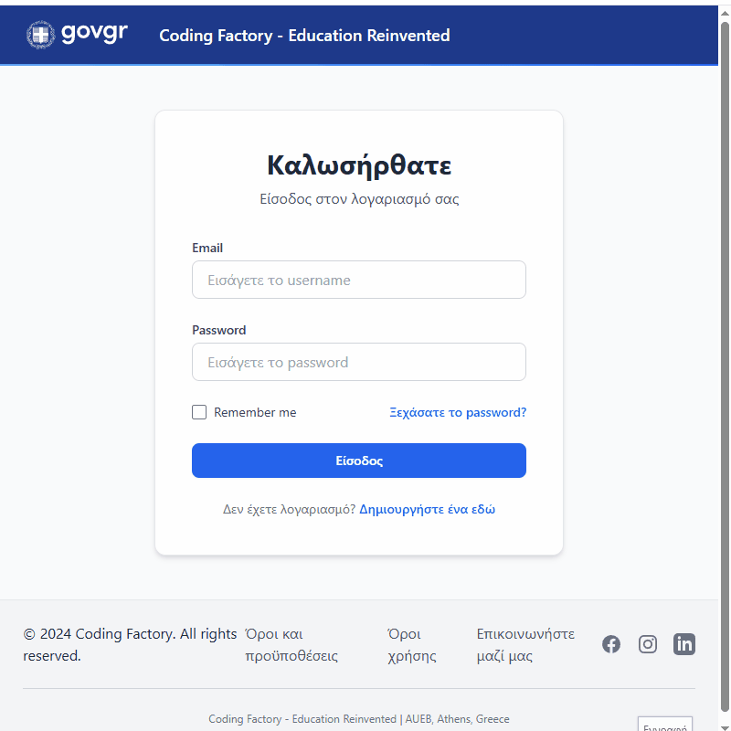

# 🎓 Java School Management Web App

A complete school management system built with Java Servlets and JSP, following a layered MVC architecture (Controllers → Services → DAOs → Models).

The application manages Teachers and Students, with full CRUD operations, authentication, and a clean responsive UI inspired by gov.gr design standards.

---

## ✨ Features

- 🔒 User Authentication and Role-based Authorization (Admin-only actions)
- 🧑‍🏫 CRUD Operations for Teachers
- 🎒 CRUD Operations for Students
- 🛡️ Server-side Validation (Data Integrity & Security)
- 🧹 PRG Pattern to Prevent Form Resubmission
- 🔍 Filtering and Search Functionality
- 🎨 Modern, responsive UI with TailwindCSS and FontAwesome
- 📚 Clean project structure following MVC and layered architecture

---

## 🛠 Tech Stack

- Java 17
- Jakarta EE (Servlets, JSP, JSTL)
- MySQL 8+
- TailwindCSS
- FontAwesome
- Jetty Server (for local deployment)

---

## 📸 Screenshots

### Dashboard


*(GIF Demo: Dashboard → View Teachers → Insert Student → Update Student → View Students)*

---

## 🚀 How to Setup

1. Clone this repository:

    ```bash
    git clone https://github.com/GettingFunky/java-school-management-legacy.git
    ```

2. Import the provided MySQL database dump:

    - File: `school7dbstaging.sql`
    - Use your MySQL client (Workbench, CLI, phpMyAdmin) to import it.

3. Configure database credentials:

    - Edit `DBUtil.java` (located in `/src/main/java/gr/aueb/cf/schoolapp/util/DBUtil.java`) with your own:
      ```java
      private static final String DB_USER = "root";   // Your username
      private static final String DB_PASSWORD = "password"; // Your password
      ```

4. Deploy the project using Jetty, Tomcat, or any Servlet container.

5. Access the app at:

    ```
    http://localhost:8080/school-app/
    ```

6. **Default User Credentials:**

   | Username | Password    | Role          |
      |----------|--------------|---------------|
   | admin    | admin        | ADMIN         |
   | lightadmin | lightadmin | LIGHT_ADMIN   |

   *(Update or create users directly from the database if needed.)*

---

## 📚 Project Context

This project was developed as part of a full-stack educational bootcamp to master Java web development foundations.

It covers crucial topics like:

- Web MVC Architecture
- Server-side Form Validation
- Authentication & Authorization Mechanisms
- Database Interactions via DAO Pattern
- Clean Code Principles

✅ Successfully completed and continuously improved to meet real-world coding standards.

---

## 📎 Links

- [🔗 GitHub Repository](https://github.com/GettingFunky/java-school-management-legacy)

---

## 🛡️ License

This project is licensed for educational and personal portfolio use. 🚀
